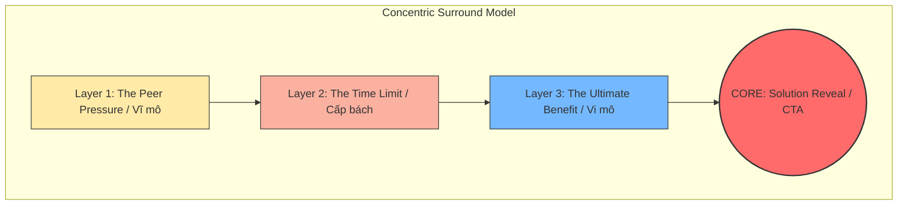

---
metadata:
  chunk_id: "3A-3I-1G-DONG-TAM-001"
  source: "Nghệ Thuật Bố Cục Đồng Tâm Trong Content Marketing C1 - 3F.docx"
  heading_path: "02-frameworks/content-layout-systems/01-core-layouts/dong-tam-layout"
  timestamp: "2026-05-25"
  relevance_score: 1.0
  marketing_tags:
    target_audience:
      - "copywriter"
      - "marketer"
      - "content_creator"
    pain_point:
      - "phan_khang_quang_cao"
      - "hard_sell_that_bai"
      - "thieu_chuyen_doi"
    angle:
      - "bao_vay_tam_ly"
      - "ban_nhu_khong_ban"
      - "inception_tu_thuyet_phuc"
    brand_voice:
      - "tinh_te"
      - "thuyet_phuc"
      - "sau_sac"
    use_case:
      - "high_ticket_sales"
      - "personal_branding"
      - "storytelling"
    content_format:
      - "pr_article"
      - "case_study"
      - "nurturing_email"
---

# Đồng Tâm (Concentric Layout)

## Status

Ingested (New Ingestion Batch 3A-3I-1G)

## Source Files

- `docs/Nghệ Thuật Bố Cục Đồng Tâm Trong Content Marketing C1 - 3F.docx` (Primary - Ingested Batch 3A-3I-1G)
- `docs/Kiến Trúc Bố Cục Trong Content Marketing Đột Phá C1 - 3.docx` (Supporting - Ingested Batch 3A-3I-1A)

## Definition

Bố cục Đồng tâm (Concentric Structure) là cách tổ chức nội dung theo mô hình vòng tròn đồng tâm, dẫn dắt độc giả đi qua từng lớp bối cảnh từ ngoài vào trong, từ tổng quát đến chi tiết, nhằm hướng tư duy của họ về một thông điệp cốt lõi duy nhất nằm ở trung tâm mà không cần hô hào trực diện.

## Core Mindset

- **Nghệ thuật "Bao vây tâm lý"**: Thay vì tấn công trực diện vào bức tường phòng thủ quảng cáo của khách hàng, bố cục này thiết lập một bối cảnh rộng lớn ở lớp ngoài để thu hút sự chú ý và làm dịu sự đề phòng, sau đó thu hẹp dần vòng vây để dẫn độc giả tới điểm chốt sale một cách tự nhiên.
- **Nguyên lý Tự thuyết phục (Self-Persuasion)**: Khách hàng luôn có xu hướng tin tưởng tuyệt đối vào những quyết định hoặc kết luận do chính họ suy luận ra. Bố cục Đồng tâm cung cấp đầy đủ các luận điểm/tiêu chí vây quanh tâm điểm để độc giả tự lắp ghép thành bức tranh hoàn chỉnh và tự đưa ra quyết định mua hàng.
- **Giống như bóc củ hành tây**: Người viết dắt tay khách hàng đi qua từng lớp bối cảnh ngoài cùng, bóc tách từng lớp thông tin một cách mạch lạc, để rồi khi chạm đến lõi bên trong, khách hàng hoàn toàn bị thuyết phục và đón nhận giải pháp trong sự tự nguyện.

## Core Principles

- **Một tâm điểm duy nhất**: Mọi ý tưởng, bối cảnh, luận điểm triển khai ở các lớp xung quanh đều phải làm nền và phục vụ cho một thông điệp cốt lõi duy nhất nằm ở tâm.
- **Phân lớp mạch lạc (Layering)**: Các lớp thông tin phải được phân chia rõ ràng theo khoảng cách từ vĩ mô đến vi mô, từ khách quan đến chủ quan. Tránh tình trạng viết lộn xộn giữa các lớp khiến người đọc mất phương hướng.
- **Kết nối vô hình (Seamlessness)**: Các vòng tròn bối cảnh dù trông có vẻ độc lập hoặc cách xa nhau nhưng phải có sợi dây liên kết logic ngầm để cùng hướng mũi tên lập luận về tâm điểm.

## Goal

- Hạ gục khiên phòng thủ quảng cáo của người đọc đối với các bài viết bán hàng trực diện.
- Giúp chốt sale tinh tế, đưa giải pháp xuất hiện như một mảnh ghép cuối cùng giải quyết trọn vẹn mọi vấn đề đã nêu ở các lớp ngoài.
- Xây dựng định vị thương hiệu sâu sắc và nâng cao mức độ tin tưởng của khách hàng.

## When To Use

- Bán các sản phẩm/dịch vụ có giá trị cao (High-ticket) hoặc khóa học chuyên sâu cần nhiều sự tin tưởng và thời gian cân nhắc.
- Viết bài PR cá nhân, câu chuyện thương hiệu (Storytelling) cần chiều sâu cảm xúc.
- Triển khai nội dung cho tệp khách hàng đã quá mệt mỏi và có ác cảm với quảng cáo truyền thống.

## When Not To Use

- Các bài đăng bán hàng trực tiếp, thông báo khuyến mãi nhanh, flash sale cần CTA gấp.
- Khi người viết chưa thấu hiểu insight sâu kín của khách hàng (vì bố cục này đòi hỏi sự đồng cảm rất cao).
- Content ngắn hạn trên các nền tảng có thời gian chú ý cực thấp (như banner quảng cáo, bài đăng thông báo ngắn).

## Sơ Đồ Vận Hành

### Dạng Tiêu Chuẩn

Dẫn nhập $\rightarrow$ Lớp ngoài cùng (Bối cảnh tổng quát) $\rightarrow$ Lớp giữa (Phân tích chi tiết giải thích cho ý chính) $\rightarrow$ Lớp trong cùng (Ý chính/Thông điệp cốt lõi) $\rightarrow$ Kết luận & CTA.

**Ví dụ thực tế (Bán khóa học kỹ năng mềm)**:
- **Dẫn nhập**: Gợi mở câu chuyện nhẹ nhàng về lối sống đẹp.
- **Lớp ngoài**: Khái niệm về "Sự tử tế" trong xã hội hiện đại ngày nay.
- **Lớp giữa**: Tác động của sự tử tế lên các mối quan hệ (xã hội, gia đình và cá nhân).
- **Lớp trong (Lõi)**: Chỉ ra rằng sự tử tế thực chất đem lại hạnh phúc, sự bình yên lớn nhất cho chính bản thân người trao đi.
- **Kết luận & CTA**: Kỹ năng mềm (giao tiếp, lắng nghe, thấu cảm) là mắt xích cốt lõi để rèn luyện sự tử tế $\rightarrow$ Kêu gọi tham gia khóa học kỹ năng mềm.

---

### Dạng Nâng Cao: Nghệ thuật "Bán như không bán" (Subtle Pitching)

Ở dạng nâng cao, người viết không cần nhắc trực tiếp đến thông điệp cốt lõi ở giữa bài. Thay vào đó, ta đưa ra các luận cứ vây quanh điểm trung tâm, tạo ra một lực hút logic hướng tâm khiến độc giả tự rút ra kết luận cốt lõi.

#### Ví dụ 1: Đời sống (Mẹ giục con lấy chồng/lấy vợ)
Người mẹ hoàn toàn không nói câu mệnh lệnh "Hãy lấy vợ đi" (tránh gây phản kháng ở đứa con). Thay vào đó, bà đưa ra các luận cứ vây quanh:
- **Luận cứ**: Con trai nhà hàng xóm bằng tuổi con đã dắt con đi học lớp một. (Ý ngầm: Con đã lớn tuổi rồi).
- **Luận cứ**: Bố mẹ năm nay đã ngoài sáu mươi tuổi, sức khỏe còn tốt để trông cháu giúp con. (Ý ngầm: Đẻ sớm để có người hỗ trợ).
- **Luận cứ**: Phải có một người vợ quán xuyến việc nhà cửa cơm nước thì con mới yên tâm làm ăn khá lên được. (Ý ngầm: Cần một hậu phương).
- **Kết quả**: Đứa con nghe xong không hề cảm thấy bị ép buộc nhưng tự nhận thức được thông điệp cốt lõi: Đã đến lúc mình phải lập gia đình.

#### Ví dụ 2: Thực chiến (Bán khóa học Marketing)
Giảng viên không kêu gọi "Hãy mua khóa học Marketing của tôi đi". Thay vào đó, giảng viên đưa ra các luận điểm bao vây:
- **Luận cứ**: Muốn học Marketing thực chiến hiệu quả thì bắt buộc phải có một lộ trình học tập bài bản, đi từ gốc rễ.
- **Luận cứ**: Quá trình thực hành cần có một người thầy giỏi trực tiếp chấm và sửa bài chi tiết để sửa sai kịp thời.
- **Luận cứ**: Phải có bộ tài liệu chuẩn và một cộng đồng chất lượng để cùng trao đổi, rèn luyện thực chiến mỗi ngày.
- **Kết quả**: Khách hàng tự đối chiếu và thấy bản thân đang thiếu cả ba yếu tố này. Đồng thời, họ nhận ra khóa học của giảng viên (với chi phí hợp lý) đáp ứng hoàn hảo cả ba tiêu chí đó $\rightarrow$ Khách hàng tự chốt sale và chủ động đăng ký mua khóa học.

---

## Framework: Concentric Surround Model (Mô Hình Bao Vây Đồng Tâm)

Đây là khung xây dựng nội dung bao vây tâm lý nhằm cấy ghép ý tưởng (Inception) vào tâm trí khách hàng:

### Các Bước Triển Khai Chi Tiết (Dạng Nâng Cao)

1.  **Core Definition (Xác định Tâm)**:
    - Viết ra nháp thông điệp cốt lõi/sản phẩm muốn bán (Ví dụ: Đăng ký dịch vụ chăm sóc da tại Spa của tôi).
    - *Lưu ý*: Câu chốt trực diện này bắt buộc không được viết vào phần thân bài viết.
2.  **Layer 1 - The Peer Pressure (Áp lực đồng trang lứa / Bối cảnh vĩ mô)**:
    - Kể về bối cảnh xung quanh, sự thay đổi tích cực của bạn bè, đồng nghiệp hoặc xu hướng chung xã hội (Ví dụ: Bạn bè xung quanh da dẻ ai cũng mịn màng, rạng rỡ và tự tin).
3.  **Layer 2 - The Time Limit (Áp lực thời gian / Sự cấp bách)**:
    - Nhấn mạnh yếu tố thời gian hoặc tính chất lão hóa tự nhiên để kích thích nỗi đau ngầm (Ví dụ: Phụ nữ sau tuổi ba mươi da sẽ lão hóa rất nhanh, nếp nhăn hình thành sâu nếu không chăm sóc kịp thời).
4.  **Layer 3 - The Ultimate Benefit (Lợi ích tối thượng / Bối cảnh vi mô)**:
    - Vẽ ra viễn cảnh tốt đẹp về lâu dài của việc giải quyết vấn đề (Ví dụ: Sở hữu làn da khỏe đẹp giúp thăng tiến trong công việc và giữ lửa hạnh phúc gia đình).
5.  **The Reveal (Lộ diện giải pháp)**:
    - Giới thiệu dịch vụ Spa một cách nhẹ nhàng như một công cụ giúp hiện thực hóa cả ba lớp bối cảnh trên một cách nhanh chóng và tối ưu nhất.

### Đánh giá Framework

*   **Ưu điểm**: Khách hàng cảm thấy được thấu hiểu sâu sắc, giảm thiểu tối đa tỷ lệ thoát trang do phản cảm quảng cáo, tỷ lệ chuyển đổi mượt mà và bền vững.
*   **Nhược điểm**: Đòi hỏi người viết phải có tư duy insight cực kỳ nhạy bén. Đối với độc giả có thói quen đọc lướt quá nhanh, họ có thể bỏ qua bối cảnh và không nắm được ý đồ ngầm của bài viết.

---

## Core Skills

- **Kỹ năng Phân lớp thông tin (Information Layering)**: Khả năng nhìn nhận một vấn đề từ bức tranh toàn cảnh (vĩ mô) và thu hẹp dần khoảng cách về tiêu điểm chi tiết (vi mô) mà không làm gãy mạch logic.
  - *Cách luyện tập*: Chọn một chủ đề bất kỳ (Ví dụ: Đọc sách). Hãy tập chia nhỏ thành 3 vòng tròn: Lớp ngoài (Thói quen đọc sách trên thế giới và lợi ích vĩ mô) $\rightarrow$ Lớp giữa (Cách đọc sách thay đổi tư duy làm việc của dân văn phòng) $\rightarrow$ Lớp trong (Cảm xúc bình yên và sự tập trung của chính bạn mỗi tối khi lật từng trang sách).
- **Kỹ năng Bán hàng gián tiếp (Subtle Pitching)**: Khả năng khéo léo thiết lập các tiêu chí/luận điểm của một giải pháp lý tưởng sao cho các tiêu chí đó trùng khớp hoàn toàn với tính năng và giá trị sản phẩm của mình.
- **Kỹ năng Thấu hiểu Insight sâu sắc (Deep Customer Insight)**: Khả năng lắng nghe và khai thác những mong muốn thầm kín, những nỗi đau không nói thành lời của khách hàng mục tiêu để làm chất liệu thiết kế bối cảnh bao vây.

---

## Common Mistakes

- **Trình bày các lớp lộn xộn**: Đang viết ở lớp chi tiết (vi mô) lại đột ngột nhảy ra lớp bối cảnh rộng (vĩ mô), khiến độc giả bị rối và mất phương hướng khi theo dõi mạch bài viết.
- **Sợ độc giả không hiểu nên viết quá trực diện**: Người viết do thiếu tự tin nên ở phần cuối bài vẫn cố tình đưa vào những câu chốt sale thô thiển, phá hỏng toàn bộ bẫy tâm lý tự thuyết phục đã kỳ công xây dựng trước đó.
- **Lớp ngoài quá xa rời tâm**: Chọn bối cảnh lớp ngoài quá rộng hoặc không có liên kết logic ngầm với thông điệp cốt lõi, khiến người đọc cảm thấy bài viết bị lan man, lạc đề.

---

## Checklist

- [ ] Thông điệp cốt lõi ở tâm đã được xác định rõ ràng trên nháp trước khi viết chưa?
- [ ] Các lớp bối cảnh đã được sắp xếp theo đúng trình tự từ ngoài vào trong (hoặc từ vĩ mô đến vi mô) chưa?
- [ ] Giữa các lớp thông tin đã có câu chuyển ý tự nhiên để đảm bảo tính liền mạch chưa?
- [ ] Các luận cứ bao quanh đã đủ thuyết phục để độc giả tự suy luận ra kết luận mà không cần người viết phải nói thẳng chưa?
- [ ] Đã kiểm tra để đảm bảo không có câu chốt sale thô thiển (hard-sell) chen ngang vào các lớp bối cảnh chưa?
- [ ] Đã rà soát và loại bỏ hoàn toàn các chữ số trần dẫn nguồn thô ra khỏi phần bài viết chính chưa?

---

## Difference From Similar Layouts

- **Khác Quy nạp**: Quy nạp yêu cầu tính logic dọc tuyến tính cực kỳ nghiêm ngặt, luận cứ trước bắt buộc phải làm nền làm móng cho luận cứ sau để cùng suy ra một kết luận duy nhất ở cuối. Đồng tâm phân chia theo các lớp vòng tròn bao bọc, các luận cứ ở dạng nâng cao có thể độc lập, nằm ngang hàng nhưng tất cả cùng chiếu tia sáng vào tâm ở giữa.
- **Khác Tổng Phân Hợp**: Tổng Phân Hợp khẳng định ý chính ngay từ đầu và lặp lại ở cuối bài. Bố cục Đồng tâm chủ động "giấu" ý chính ở các lớp ngoài và chỉ hé lộ dần dần hoặc để người đọc tự nhận ra ở lõi trong cùng.
- **Khác Diễn dịch**: Diễn dịch đưa kết luận lên ngay đầu bài viết để thu hút sự chú ý nhanh. Đồng tâm làm dịu sự phòng vệ bằng cách đưa bối cảnh rộng lên trước rồi mới dẫn vào kết luận sau.

---

## Source Mapping

| Source file | Extracted knowledge | Target section | Confidence |
|---|---|---|---|
| `docs/Nghệ Thuật Bố Cục Đồng Tâm Trong Content Marketing C1 - 3F.docx` | Khái niệm bố cục đồng tâm, mô hình vòng tròn từ ngoài vào trong, tư duy "bao vây tâm lý" và hạ khiên phòng thủ quảng cáo. | Definition, Core Mindset, Core Principles | High |
| `docs/Nghệ Thuật Bố Cục Đồng Tâm Trong Content Marketing C1 - 3F.docx` | Sơ đồ vận hành tiêu chuẩn, quy trình dẫn nhập, các lớp ngoài-giữa-trong, ví dụ giảng viên về lớp học kỹ năng mềm. | Sơ đồ vận hành | High |
| `docs/Nghệ Thuật Bố Cục Đồng Tâm Trong Content Marketing C1 - 3F.docx` | Hướng dẫn nâng cao Subtle Pitching, ví dụ người mẹ giục con lấy vợ, ví dụ bán khóa học marketing bằng các tiêu chuẩn, tư duy Inception. | Subtle Pitching (Advanced) | High |
| `docs/Nghệ Thuật Bố Cục Đồng Tâm Trong Content Marketing C1 - 3F.docx` | Khung xây dựng Concentric Surround Model, các bước triển khai chi tiết từ nháp đến lộ diện giải pháp, ưu nhược điểm. | Framework: Concentric Surround Model | High |
| `docs/Nghệ Thuật Bố Cục Đồng Tâm Trong Content Marketing C1 - 3F.docx` | So sánh chi tiết sự khác nhau về tính chất logic dọc của Quy nạp so với tính chất hướng tâm của Đồng tâm. | Difference From Similar Layouts | High |
| `docs/Nghệ Thuật Bố Cục Đồng Tâm Trong Content Marketing C1 - 3F.docx` | Tư duy content marketing (Macro-Micro-Core funnel), 3 kỹ năng cốt lõi (Information Layering, Subtle Pitching, Deep Insight). | Core Skills, Core Mindset | High |
| `docs/Nghệ Thuật Bố Cục Đồng Tâm Trong Content Marketing C1 - 3F.docx` | Sai lầm trình bày lộn xộn lớp, sợ người đọc không hiểu viết hard-sell, checklist kiểm duyệt đồng tâm. | Common Mistakes, Checklist | High |
| `docs/Kiến Trúc Bố Cục Trong Content Marketing Đột Phá C1 - 3.docx` | Xác nhận Đồng tâm là 1 trong 6 bố cục gốc chính thức của hệ thống layout content marketing. | Status, Definition | High |
