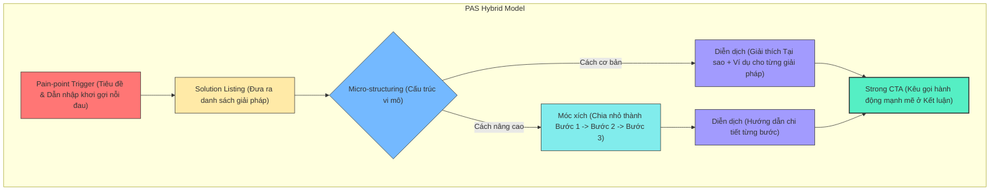

---
metadata:
  chunk_id: "3A-3I-1H-VAN-DE-GIAI-PHAP-001"
  source: "Nghệ Thuật Mix Bố Cục Vấn Đề - Giải Pháp Đa Tầng C1 - 3G.docx"
  heading_path: "02-frameworks/content-layout-systems/01-core-layouts/van-de-giai-phap-layout"
  timestamp: "2026-05-25"
  relevance_score: 1.0
  marketing_tags:
    target_audience:
      - "copywriter"
      - "marketer"
      - "content_creator"
    pain_point:
      - "viet_hoi_hot"
      - "sao_rong"
      - "thieu_chuyen_doi"
      - "khach_hang_thoat_trang"
    angle:
      - "xoay_sau_noi_dau"
      - "phac_do_dieu_tri"
      - "inception_lap_ghep_da_tang"
      - "cam_tay_chi_viec"
    brand_voice:
      - "thuc_te"
      - "logic"
      - "tin_cay"
      - "chuyen_gia"
    use_case:
      - "how_to_content"
      - "tiktok_youtube_video_script"
      - "sales_copy"
      - "blog_post"
    content_format:
      - "ads_copy"
      - "short_video_script"
      - "guide_article"
---

# Vấn Đề - Giải Pháp (Problem-Solution Layout)

## Status

Ingested (New Ingestion Batch 3A-3I-1H)

## Source Files

- `docs/Nghệ Thuật Mix Bố Cục Vấn Đề - Giải Pháp Đa Tầng C1 - 3G.docx` (Primary - Ingested Batch 3A-3I-1H)
- `docs/Kiến Trúc Bố Cục Trong Content Marketing Đột Phá C1 - 3.docx` (Supporting - Ingested Batch 3A-3I-1A)

## Definition

Bố cục Vấn đề - Giải pháp (Problem-Solution Layout) là cấu trúc tổ chức nội dung tập trung vào việc khơi gợi, xoáy sâu vào nỗi đau, vấn đề cốt lõi của khách hàng mục tiêu ở phần đầu (Tiêu đề và Dẫn nhập), sau đó cung cấp các giải pháp cụ thể, chi tiết ở phần thân bài để giữ chân khách hàng và thúc đẩy chuyển đổi thông qua lời kêu gọi hành động rõ ràng ở phần kết bài.

## Core Mindset

- **Tư duy "Bắt bệnh - Kê đơn"**: Khách hàng không quan tâm đến bạn hay sản phẩm của bạn, họ chỉ quan tâm đến vấn đề của chính họ. Một bài viết xuất sắc giống như một đơn thuốc: bốc đúng căn bệnh (nỗi đau) ở phần tiêu đề/dẫn nhập để thu hút sự chú ý (Attention), và cung cấp phác đồ điều trị (giải pháp chi tiết) ở thân bài để giữ chân và thuyết phục.
- **Kỹ thuật "Inception" (Lắp ghép đa tầng / Modular Thinking)**: Các bố cục không tồn tại độc lập mà hoạt động như các mô-đun (modules). Bố cục Vấn đề - Giải pháp đóng vai trò là vỏ bọc cấu trúc lớn bên ngoài, trong khi các bố cục cơ bản khác (Diễn dịch, Móc xích) được nhúng/lắp ghép vào bên trong để làm lõi nhằm tăng chiều sâu lý luận và tính thuyết phục.
- **Thuyết phục bằng sự chi tiết (Specificity)**: Lời nói suông không có sức thuyết phục. Uy tín thương hiệu và lòng tin được xây dựng bằng cách mô tả thật kỹ từng giải pháp để độc giả dễ dàng hình dung và làm theo ngay lập tức.

## Core Principles

- **Bắt trúng nỗi đau**: Phải xác định chính xác vấn đề cốt lõi đang khiến khách hàng trăn trở để đưa lên ngay phần tiêu đề hoặc những giây đầu tiên của video. Bắt sai bệnh sẽ khiến giải pháp phía sau vô nghĩa.
- **Phân tách & Lồng ghép Module**: Từng giải pháp đưa ra không được liệt kê hời hợt mà phải được cụ thể hóa bằng cách lồng ghép bố cục Diễn dịch (giải thích tại sao, cơ chế tâm lý, ví dụ minh họa) hoặc bố cục Móc xích (chia nhỏ thành các bước liên kết chặt chẽ).
- **Tập trung vào chất lượng hơn số lượng**: Không nên ôm đồm quá nhiều giải pháp trong một bài viết. Hãy đưa ra ít giải pháp nhưng diễn giải sâu sắc và móc xích chặt chẽ.

## Goal

- Khắc phục tình trạng viết nội dung hướng dẫn/chia sẻ bị hời hợt, sáo rỗng, thiếu giá trị thực tế.
- Khơi gợi và kích hoạt nỗi đau ngầm hiểu của khách hàng để tạo sự chú ý tức thì.
- Giữ chân độc giả lâu hơn trên trang và thúc đẩy tỷ lệ chuyển đổi mượt mà bằng giải pháp mang tính ứng dụng cao.

## When To Use

- Viết bài quảng cáo (Ads Copy) giải quyết nỗi đau cụ thể của khách hàng mục tiêu.
- Viết kịch bản video ngắn (TikTok, YouTube Shorts) dạng chia sẻ mẹo, kiến thức nhanh.
- Bài viết blog hướng dẫn (How-to content), định vị nhân hiệu chuyên gia (Expert positioning).

## When Not To Use

- Khi viết các nội dung mang tính giải trí thuần túy hoặc không có vấn đề/nỗi đau rõ ràng để khai thác.
- Khi người viết chưa thấu hiểu hoặc chưa nghiên cứu kỹ nỗi đau thực tế của khách hàng mục tiêu.

## Sơ Đồ Vận Hành

### Dạng Tiêu Chuẩn (Problem-Solution + Diễn dịch)

Thu hút (Tiêu đề/Dẫn nhập) $\rightarrow$ Giữ chân (Thân bài - Đưa ra các Giải pháp) $\rightarrow$ Lồng ghép Diễn dịch vào từng giải pháp (Giải thích tại sao, cơ chế tâm lý, ví dụ cụ thể) $\rightarrow$ Thúc đẩy hành động (Kết bài & CTA).

**Ví dụ thực tế**: Chủ đề "Cách đặt tiêu đề thu hút"
- **Thu hút**: Khắc phục lỗi đặt tiêu đề hời hợt, sáo rỗng khiến người đọc lướt qua ngay lập tức.
- **Giải pháp 1**: Đưa số liệu vào tiêu đề $\rightarrow$ **Diễn dịch**: Giải thích tại sao số liệu ảnh hưởng tới tâm lý khán giả khi họ xem.
- **Giải pháp 2**: Dùng câu từ đẩy cao cảm xúc (tò mò, hối thúc) $\rightarrow$ **Diễn dịch**: Đưa ra các ví dụ cụ thể để khán giả dễ dàng bắt chước.
- **CTA**: Đăng ký nhận bộ template 100 dòng tiêu đề triệu view.

---

### Dạng Nâng Cao (Problem-Solution + Móc xích + Diễn dịch)

Thu hút (Tiêu đề/Dẫn nhập) $\rightarrow$ Giữ chân (Thân bài - Giải pháp lớn) $\rightarrow$ Dùng Móc xích chia nhỏ giải pháp lớn thành các Bước liên kết tuần tự (Bước 1 $\rightarrow$ Bước 2 $\rightarrow$ Bước 3) $\rightarrow$ Lồng ghép Diễn dịch chi tiết cho từng Bước $\rightarrow$ Thúc đẩy hành động (Kết luận & CTA).

**Ví dụ thực tế**: Chủ đề "Cách viết content cho người mới"
- **Thu hút**: Xoáy vào nỗi sợ viết lách bị lan man, bí ý tưởng của người mới bắt đầu.
- **Giải pháp 1**: Tập trung vào chủ thể:
  - **Bước 1 (Móc xích 1)**: Xác định chủ thể $\rightarrow$ **Diễn dịch**: Hướng dẫn cách làm.
  - **Bước 2 (Móc xích 2)**: Lựa chọn chủ thể hiệu quả $\rightarrow$ **Diễn dịch**: Chi tiết hóa tiêu chí lựa chọn.
  - **Bước 3 (Móc xích 3)**: Lựa chọn góc nhìn $\rightarrow$ **Diễn dịch**: Hướng dẫn chọn góc nhìn phù hợp mục tiêu.
- **Giải pháp 2**: Đưa yếu tố xác thực tăng logic:
  - **Bước 1**: Xác định yếu tố xác thực $\rightarrow$ **Diễn dịch**: Chọn lọc các thông tin, số liệu uy tín.
  - **Bước 2**: Biên soạn/lựa chọn tài liệu kiểm chứng $\rightarrow$ **Diễn dịch**: Cách xử lý và đưa tài liệu kiểm chứng vào bài.
  - **Bước 3**: Chọn vị trí đặt trong bài viết $\rightarrow$ **Diễn dịch**: Vị trí đắc địa nhất để tăng lòng tin.
- **CTA**: Tải checklist kiểm duyệt logic bài viết.

---

## Framework: P.A.S Hybrid Model (Mô Hình Vấn Đề - Giải Pháp Đa Tầng)

Đây là khung xây dựng nội dung kết hợp để tạo ra chiều sâu lý luận vượt trội cho các nội dung chia sẻ/hướng dẫn:

### Các Bước Triển Khai Chi Tiết

1. **Pain-point Trigger (Kích hoạt Nỗi đau)**:
   - Nghiên cứu và tìm ra nỗi đau cốt lõi, vấn đề cụ thể mà khán giả đang gặp phải.
   - Thể hiện trực tiếp tại Tiêu đề và Dẫn nhập để lôi kéo sự chú ý ngay lập tức.
2. **Solution Listing (Liệt kê Giải pháp)**:
   - Đưa ra danh sách các giải pháp thực tế để xử lý vấn đề trên.
3. **Micro-structuring (Cấu trúc vi mô trong từng giải pháp)**:
   - *Cách cơ bản*: Lồng ghép Diễn dịch để giải thích lý do vì sao giải pháp này hoạt động, cơ chế tâm lý phía sau và đưa ví dụ thực tế minh họa.
   - *Cách nâng cao*: Lồng ghép Móc xích để chia nhỏ giải pháp thành một chuỗi quy trình hành động tuần tự (Bước 1, Bước 2, Bước 3), sau đó dùng Diễn dịch để chi tiết hóa cách làm của từng bước.
4. **Strong CTA (Kêu gọi hành động mạnh mẽ)**:
   - Kết luận bài viết bằng cách khẳng định lại giá trị của phác đồ điều trị, kêu gọi độc giả thực hiện ngay hoặc chuyển đổi sang hành động tiếp theo.

### Đánh giá Framework

* **Ưu điểm**: Tạo cảm giác nội dung có chiều sâu và tính ứng dụng thực tế cao nhờ tư duy "cầm tay chỉ việc", giúp xây dựng uy tín chuyên gia mạnh mẽ.
* **Nhược điểm**: Đòi hỏi nghiên cứu sâu bối cảnh và kỹ năng kết hợp nhiều cấu trúc bố cục một cách tự nhiên để tránh bài viết bị rời rạc, cứng nhắc.

---

## Core Skills

- **Kỹ năng Bắt mạch nỗi đau (Pain-point Discovery)**: Khả năng xác định đúng vấn đề cốt lõi mà khách hàng đang trăn trở để đưa lên ngay phần Tiêu đề và Dẫn nhập. Nếu bắt sai bệnh, giải pháp phía sau sẽ trở nên vô nghĩa.
- **Kỹ năng Mix Bố cục (Layout Blending)**: Khả năng lồng ghép khéo léo bố cục Diễn dịch hoặc Móc xích vào bên trong bố cục Vấn đề - Giải pháp để nâng cấp bài viết từ mức độ liệt kê hời hợt sang phân tích chuyên sâu.
- **Kỹ năng Hệ thống hóa (Step-by-step Structuring)**: Khả năng chia nhỏ một giải pháp vĩ mô trừu tượng thành một chuỗi quy trình hành động cụ thể, rõ ràng để độc giả dễ dàng thực hiện.

---

## Common Mistakes

- **Bắt sai bệnh hoặc đưa vấn đề quá chung chung**: Nêu vấn đề hời hợt, sáo rỗng khiến người đọc không cảm thấy liên quan và lướt qua ngay lập tức.
- **Chỉ liệt kê giải pháp chung chung**: Đưa ra những lời khuyên lý thuyết mơ hồ mà không có diễn dịch chi tiết hay ví dụ trực quan đi kèm.
- **Tách rời hoặc lồng ghép khiên cưỡng các bố cục**: Việc chuyển tiếp giữa Vấn đề - Giải pháp sang Diễn dịch/Móc xích bị gãy, khiến mạch bài viết trở nên cứng nhắc và khó theo dõi.

---

## Checklist

- [ ] Đã xác định đúng nỗi đau cốt lõi của khách hàng mục tiêu để đưa lên tiêu đề/dẫn nhập chưa?
- [ ] Từng giải pháp đề xuất đã được lồng ghép bố cục Diễn dịch (đưa ra lý do, cơ chế, ví dụ) hoặc Móc xích (chia bước cụ thể) chưa?
- [ ] Đã hạn chế số lượng giải pháp để tập trung diễn giải sâu sắc chưa?
- [ ] Phần kết luận đã có lời kêu gọi hành động (CTA) rõ ràng và mạnh mẽ chưa?
- [ ] Đã rà soát và loại bỏ hoàn toàn các chữ số trần dẫn nguồn thô ra khỏi phần bài viết chính chưa?

---

## Difference From Similar Layouts

- **Khác Liệt kê**: Bố cục Liệt kê chỉ trình bày các ý/mẹo song song ngang hàng mà không yêu cầu bắt buộc khơi gợi nỗi đau ở đầu hay đi sâu lồng ghép đa tầng các bố cục Diễn dịch/Móc xích vào thân bài.
- **Khác Móc xích**: Móc xích tập trung hoàn toàn vào liên kết tuyến tính chặt chẽ giữa các bước trong toàn bộ bài viết, trong khi Vấn đề - Giải pháp sử dụng Móc xích như một mô-đun phụ trợ bên trong từng giải pháp cụ thể.
- **Khác Diễn dịch**: Diễn dịch đưa kết luận/luận điểm lớn lên đầu và chứng minh ở phía sau, còn Vấn đề - Giải pháp tập trung khơi gợi bối cảnh nỗi đau trước rồi mới dẫn dắt khán giả tới giải pháp.

---

## Source Mapping

| Source file | Extracted knowledge | Target section | Confidence |
|---|---|---|---|
| `docs/Nghệ Thuật Mix Bố Cục Vấn Đề - Giải Pháp Đa Tầng C1 - 3G.docx` | Khái niệm bố cục Vấn đề - Giải pháp, bản chất, tư duy "Bắt bệnh - Kê đơn", khơi gợi nỗi đau và thu hút sự chú ý. | Definition, Core Mindset, Core Principles | High |
| `docs/Nghệ Thuật Mix Bố Cục Vấn Đề - Giải Pháp Đa Tầng C1 - 3G.docx` | Kỹ thuật cơ bản mix Vấn đề - Giải pháp + Diễn dịch, ví dụ thực tế về chủ đề đặt tiêu đề thu hút. | Sơ đồ vận hành, Core Mindset | High |
| `docs/Nghệ Thuật Mix Bố Cục Vấn Đề - Giải Pháp Đa Tầng C1 - 3G.docx` | Kỹ thuật nâng cao mix Vấn đề - Giải pháp + Móc xích + Diễn dịch, ví dụ thực tế về viết content cho người mới. | Sơ đồ vận hành, Core Mindset | High |
| `docs/Nghệ Thuật Mix Bố Cục Vấn Đề - Giải Pháp Đa Tầng C1 - 3G.docx` | Trích xuất framework P.A.S Hybrid Model, các bước triển khai chi tiết, ưu nhược điểm và ứng dụng thực tế. | Framework: P.A.S Hybrid Model | High |
| `docs/Nghệ Thuật Mix Bố Cục Vấn Đề - Giải Pháp Đa Tầng C1 - 3G.docx` | Tư duy content marketing của giảng viên: tư duy lắp ghép module, thuyết phục bằng sự chi tiết, tâm lý tránh né nỗi đau, phễu nội dung. | Core Mindset, Framework: P.A.S Hybrid Model | High |
| `docs/Nghệ Thuật Mix Bố Cục Vấn Đề - Giải Pháp Đa Tầng C1 - 3G.docx` | Các kỹ năng cốt lõi được giảng dạy: Pain-point Discovery, Layout Blending, Step-by-step Structuring. | Core Skills | High |
| `docs/Nghệ Thuật Mix Bố Cục Vấn Đề - Giải Pháp Đa Tầng C1 - 3G.docx` | Những sai lầm người mới dễ mắc, checklist kiểm duyệt bố cục vấn đề - giải pháp đa tầng. | Common Mistakes, Checklist | High |
| `docs/Kiến Trúc Bố Cục Trong Content Marketing Đột Phá C1 - 3.docx` | Xác nhận Vấn đề - Giải pháp là một trong các bố cục chính của hệ thống layout content marketing. | Status, Definition | High |
