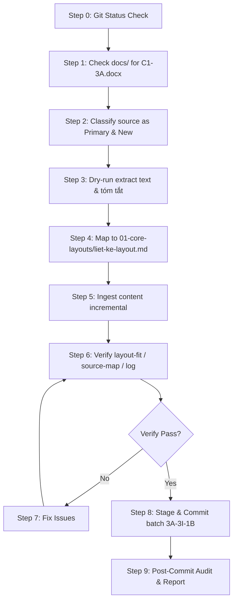

# Knowledge Ingestion SOP

## 1. Purpose (Mục đích)

- SOP này dùng để chuẩn hóa quy trình nạp tài liệu khóa học, kiến thức từ `docs/` vào bộ `agentic-ai-content-marketing-skill`.
- Mỗi lần người dùng chỉ định file hoặc yêu cầu nạp dữ liệu, Agent bắt buộc phải tuân theo đúng pipeline 9 bước này.
- SOP này được áp dụng cho từng file hoặc từng nhóm file riêng lẻ theo từng batch riêng biệt, không dùng để tự động nạp hàng loạt mà không có sự kiểm soát.
- SOP này không thay thế cho sự phê duyệt trực tiếp của con người (Human Approval). Agent luôn phải xin xác nhận từ người dùng trước khi thực thi các bước quan trọng (như Ingestion Plan, Commit, Ingestion mới).

## 2. Trigger Phrase (Cụm từ kích hoạt)

Khi người dùng đưa ra các câu lệnh/yêu cầu có dạng:
- "Chạy gói nạp dữ liệu cho file X"
- "Nạp kiến thức từ file X"
- "Ingest file X vào SKILL"
- "Xử lý nạp dữ liệu cho source X"

Agent phải tự hiểu là cần kích hoạt và đi theo đúng pipeline của quy trình Knowledge Ingestion SOP này.

## 3. Mandatory Pipeline (Quy trình 9 bước bắt buộc)

Agent phải đi qua đầy đủ các bước sau đây theo thứ tự nghiêm ngặt:

### Step 0 — Current Git Safety Check
- Chạy lệnh: `git status --short` và `git status -sb`.
- Xác nhận rằng workspace hoàn toàn sạch (clean), ngoại trừ thư mục untracked `?? docs/`.
- Chỉ được tiếp tục nếu không có bất kỳ file staged hoặc modified chưa commit nào khác ngoài scope.

### Step 1 — Source Inventory And Exact Filename Confirmation
- Quét thư mục `docs/` để tìm file nguồn được yêu cầu.
- Xác nhận chính xác tên file nguồn (Exact Filename), định dạng file (docx, pdf, v.v.).
- Xác định rõ file nguồn thuộc chương nào, bài học nào (ví dụ: C1 - 3, C1 - 3A...). Không bao giờ đoán hoặc tự ý suy diễn tên file.

### Step 2 — Source Role Classification
- Phân loại vai trò của nguồn tài liệu trong batch hiện tại:
  - **Primary source**: Nguồn dữ liệu chính chứa kiến thức mới cần nạp.
  - **Supporting/cross-check source**: Nguồn phụ dùng để đối chiếu, làm rõ hoặc bổ sung ý cho nguồn chính.
  - **Duplicate source**: Nguồn bị trùng lặp nội dung hoàn toàn với nguồn khác đã nạp hoặc đang nạp.
  - **Previously ingested source**: Nguồn đã được nạp ở các batch trước đó.
  - **New source**: Nguồn hoàn toàn mới chưa từng được xử lý.

### Step 3 — Dry-run Extraction
- Đọc nội dung file nguồn bằng công cụ xem file hoặc trích xuất văn bản (nếu là docx/pdf, trích xuất text sạch).
- Kiểm tra chất lượng trích xuất (Extraction Quality), phát hiện lỗi ngắt dòng, lỗi font, mojibake.
- Tóm tắt sơ bộ các kiến thức cốt lõi sẽ nạp.
- Xác định xem kiến thức đó là mới hoàn toàn, trùng lặp hay mâu thuẫn với hệ thống kiến thức hiện tại trong bộ SKILL.
- **Lưu ý**: Tuyệt đối chưa chỉnh sửa bất kỳ file nào trong bộ SKILL ở bước này.

### Step 4 — Target Mapping Plan
- Lập kế hoạch bản đồ nạp (Ingestion Plan). Đề xuất cụ thể danh sách file đích sẽ cập nhật hoặc tạo mới.
- Phân biệt rõ ràng các loại file đích tương ứng với Taxonomy (Tư duy/Mindset, Framework, Bố cục/Layout, Quy trình/Workflow, Command, Quality gate, Source-map...).
- **Không tự ý tạo file bố cục mới** nếu tài liệu nguồn chưa cung cấp đủ chi tiết và cấu trúc.

### Step 5 — Actual Ingestion
- Thực hiện cập nhật nội dung kiến thức vào các file đích đã đề xuất.
- Chỉ sửa các file nằm trong phạm vi được cho phép.
- Cập nhật thông tin dưới dạng **cộng dồn** (incremental), bổ sung thêm kiến thức mới mà không xóa bỏ hoặc ghi đè các kiến thức cũ đã được xác thực.
- Tuyệt đối không sao chép nguyên văn (verbatim) các đoạn văn quá dài từ tài liệu nguồn; phải chuyển hóa thành cấu trúc tối ưu cho AI Agent.
- Không tự ý bịa đặt (hallucinate) các khái niệm nằm ngoài tài liệu nguồn.

### Step 6 — Verification
- Kiểm tra và xác thực lại toàn bộ kiến thức sau khi nạp:
  - **Verify theory**: Đảm bảo lý thuyết chính xác, không mâu thuẫn.
  - **Verify scope**: Đảm bảo sửa đúng file trong scope, không lan man.
  - **Verify source-map / course-index / log**: Đảm bảo đã cập nhật đầy đủ thông tin nguồn, số lượng file, mã batch vào `source-map.md`, `course-index.md` và `INGESTION_LOG.md`.
  - **Verify no duplicate**: Không nạp lặp kiến thức.
  - **Verify no wrong layout**: Đảm bảo không trộn lẫn các loại bố cục hoặc đưa sai vị trí.
  - **Verify encoding/mojibake**: Kiểm tra hiển thị tiếng Việt, không bị lỗi font.
  - **Verify docs safety**: Đảm bảo thư mục `docs/` vẫn an toàn, không bị sửa đổi.

### Step 7 — Fix If Needed
- Nếu bước Verification phát hiện ra bất kỳ lỗi hoặc điểm chưa nhất quán nào, thực hiện sửa lỗi ngay lập tức.
- Chỉ tập trung sửa đúng lỗi được chỉ ra, không mở rộng phạm vi điều chỉnh.
- Tiến hành Verification lại sau khi sửa (Re-verification) cho đến khi đạt trạng thái PASS hoàn toàn.

### Step 8 — Commit
- Chỉ tiến hành tạo commit sau khi quá trình Verification đã **PASS** hoàn toàn.
- Sử dụng lệnh commit cụ thể cho các file đã thay đổi, chỉ stage các file được chỉ định cụ thể.
- **Tuyệt đối không dùng `git add .` hay `git add -A`**.
- Không bao giờ add thư mục `docs/` vào git staging.
- Đặt commit message rõ ràng, tuân thủ định dạng chuẩn của dự án và thể hiện rõ mã Batch.

### Step 9 — Post-Commit Audit
- Thực hiện kiểm tra lại trạng thái git sau khi commit:
  - Kiểm tra xem commit có chứa file ngoài phạm vi không.
  - Đảm bảo branch `main` đang đồng bộ với `origin/main` (không bị ahead/behind không mong muốn trước khi push).
  - Đảm bảo thư mục `docs/` vẫn là untracked.
  - Không tồn tại bất kỳ file tạm (temp files) nào trong repository.
  - Chỉ sau khi bước Post-Commit Audit này PASS, Agent mới đề xuất batch tiếp theo cho người dùng.

---

## 4. Security Gates (Cổng bảo mật bắt buộc)

Trong suốt quy trình nạp dữ liệu, Agent phải tuân thủ các cổng kiểm soát an toàn sau:

- **Scope Lock**: Chỉ chỉnh sửa các file thuộc phạm vi cho phép của Batch. Không chỉnh sửa các file lý thuyết nền tảng hoặc file của batch khác nếu không được yêu cầu.
- **Source Lock**: Mọi kiến thức nạp vào phải có nguồn gốc rõ ràng từ file nguồn được chỉ định. Không tự ý thêm bớt lý thuyết bên ngoài.
- **Docs Safety**: Tuyệt đối không thay đổi, đổi tên hay xóa các file trong thư mục `docs/`. Thư mục này luôn phải ở trạng thái untracked.
- **No Fabrication**: Không bịa đặt ví dụ hay lý thuyết không có trong tài liệu giảng dạy gốc.
- **No Duplicate Ingestion**: Kiểm tra kỹ lưỡng lịch sử nạp dữ liệu để tránh nạp lại file đã nạp.
- **No Wrong Folder**: Đặt đúng file vào đúng thư mục cấu trúc của bộ SKILL theo quy định Targeting Rules.
- **No New Layout Without Source**: Không tự tạo layout mới khi chưa nạp chi tiết tài liệu về layout đó.
- **No Commit Before Verify**: Chỉ commit khi và chỉ khi verify đạt PASS.
- **Exact Git Add Only**: Chỉ stage chính xác các file chỉnh sửa, không dùng các lệnh add hàng loạt.
- **Temp File Safety**: Xóa sạch toàn bộ file script/file tạm trước khi kết thúc batch.
- **Encoding/Mojibake Safety**: Đảm bảo hiển thị tiếng Việt chuẩn UTF-8, không bị lỗi mã hóa ký tự.
- **Human Next-Step Approval**: Dừng lại xin ý kiến người dùng trước khi chuyển sang bước tiếp theo hoặc thực thi hành động quan trọng.

---

## 5. File Targeting Rules (Quy tắc định hướng file đích)

Khi ánh xạ kiến thức từ nguồn vào bộ SKILL, Agent phải phân phối chính xác theo cấu trúc thư mục sau:

1. **`00-course-knowledge/`**:
   - Dùng để ghi nhận bản đồ nguồn (`source-map.md`) và mục lục tổng thể của khóa học (`course-index.md`).
2. **`01-core-principles/`**:
   - Dành cho các tư duy nền tảng, tư duy viết marketing chung, triết lý cốt lõi của khóa học.
3. **`02-frameworks/`**:
   - Dành cho các framework phân tích (như 5W-1H), các hệ thống bố cục cốt lõi (`content-layout-systems/01-core-layouts/`), và các framework hỗ trợ (`02-supporting-frameworks/`).
4. **`03-workflows/`**:
   - Dành cho các quy trình hướng dẫn từng bước tạo lập content (ví dụ: Quy trình từ Raw Idea sang Outline).
5. **`04-commands/`**:
   - Dành cho việc cấu hình hoặc định nghĩa các câu lệnh tương tác của Agent (như `/outline`, `/post`, `/qa`, `/content-score`).
6. **`07-quality-gates/`**:
   - Dành cho các checklist thẩm định chất lượng bài viết hoặc đánh giá mức độ phù hợp của bố cục (Layout-fit).
7. **`10-system/safety/`**:
   - Dành riêng cho các tài liệu vận hành hệ thống, an toàn dữ liệu, và SOP nạp dữ liệu (`INGESTION_SOP.md`, `DATA_INGESTION_SAFETY.md`).

---

## 6. Batch Naming Convention (Quy ước đặt tên Batch)

Tên Batch của quy trình nạp dữ liệu phải tuân theo cấu trúc: `[Phase/Chapter]-[Batch Type]-[Batch Number]`
- Ví dụ: `3A-2I-1`, `3A-2I-2`, `3A-3I-1A`
- **Ý nghĩa ký tự viết tắt của các bước**:
  - `I` = Ingestion (Nạp dữ liệu)
  - `V` = Verification (Xác thực)
  - `F` = Fix (Sửa lỗi)
  - `C` = Commit (Lưu thay đổi)
  - `PC` = Post-Commit Audit (Kiểm toán sau commit)
  - `0` = Plan / Dry-run (Kế hoạch / Chạy thử)

---

## 7. Required Report Format (Mẫu báo cáo bắt buộc)

Sau mỗi batch hoặc bước lớn, Agent bắt buộc phải lập báo cáo theo định dạng sau:

```markdown
# Batch [Batch_ID] Ingestion Report

## 1. Verdict (Kết luận)
- [PASS / FAIL / PENDING]

## 2. Git Status
- Chi tiết trạng thái git hiện tại (`git status --short`).

## 3. Source Checked (Nguồn tài liệu đối chiếu)
- Danh sách các file nguồn trong `docs/` đã quét và sử dụng.

## 4. Files Touched (Các file đã chỉnh sửa/tạo mới)
- [MODIFY/NEW/DELETE] [tên_file](đường_dẫn_tuyệt_đối)

## 5. Security Gates (Kết quả kiểm tra cổng bảo mật)
- Kết quả đối chiếu với danh sách Security Gates.

## 6. Issues (Các vấn đề phát hiện)
- [Mô tả các vấn đề về trùng lặp, mâu thuẫn kiến thức hoặc lỗi kỹ thuật]

## 7. Next Recommended Action (Hành động khuyến nghị tiếp theo)
- Đề xuất bước tiếp theo chi tiết.
```

---

## 8. Stop Conditions (Điều kiện dừng khẩn cấp)

Agent bắt buộc phải dừng thực thi và báo cáo cho người dùng nếu gặp các điều kiện sau:
1. Workspace không sạch trước khi bắt đầu (có thay đổi chưa commit ngoài scope).
2. Tài liệu nguồn không tồn tại trong `docs/` hoặc không đúng tên yêu cầu.
3. Tên file nguồn không được chỉ định rõ ràng (mơ hồ).
4. Phát hiện thay đổi ngoài phạm vi các file đích được cho phép (out-of-scope files).
5. File trong thư mục `docs/` vô tình bị đưa vào git staging (`staged`).
6. Xuất hiện file tạm (temporary files) chưa được dọn dẹp.
7. Phát hiện rủi ro trùng lặp kiến thức cao mà chưa có phương án hợp nhất rõ ràng.
8. Phát hiện kiến thức mới mâu thuẫn trực tiếp với kiến thức cũ đã nạp.
9. Quá trình Verification chưa đạt trạng thái PASS hoàn toàn.
10. Commit scope bị sai lệch (chứa file thừa hoặc thiếu file cần thiết).
11. Git Remote Drift: Phát hiện branch cục bộ bị lệch (ahead/behind) so với origin/main trên server.

---

## 9. Example Workflow For One File (Ví dụ quy trình thực tế cho một file)

*Dưới đây là mô phỏng quy trình nạp tài liệu cho file:*
`Bố Cục Liệt Kê_ Vũ Khí Tối Ưu Content Marketing C1 - 3A.docx`

> [!NOTE]
> Đây chỉ là ví dụ để mô phỏng quy trình chạy SOP. Tuyệt đối không thực hiện nạp nội dung của file này trong batch đóng gói SOP hiện tại.



---

## 10. Taxonomy Phân Loại Kiến Thức (Bổ sung từ tài liệu cũ)

| Loại kiến thức | Định nghĩa | Ví dụ | Nên nằm ở folder nào | Không nên nằm ở folder nào |
|---|---|---|---|---|
| Mindset | Tư duy nền điều khiển cách làm content. | AI hỗ trợ tư duy, không thay thế tư duy. | `00-course-knowledge/`, `01-core-principles/` | `05-templates/`, `06-reference-banks/` |
| Core principle | Nguyên tắc cốt lõi cần tuân thủ nhiều lần. | Outline trước khi viết. | `01-core-principles/` | `04-commands/`, `05-templates/` |
| Framework | Khung phân tích hoặc ra quyết định. | 5W-1H, audience angle. | `02-frameworks/` | `03-workflows/`, `06-reference-banks/` |
| Layout system | Nguyên lý sắp xếp ý trong nội dung. | Tổng phân hợp, quy nạp, móc xích. | `02-frameworks/content-layout-systems/01-core-layouts/` | `02-frameworks/5w1h-framework.md`, `05-templates/` |
| Workflow | Chuỗi bước thực thi một nhiệm vụ. | Raw idea to Facebook post. | `03-workflows/` | `02-frameworks/`, `06-reference-banks/` |
| Command | Giao diện tác vụ người dùng gọi trực tiếp. | `/post`, `/qa`, `/content-score`. | `04-commands/`, `10-system/control/COMMAND_MAPPING.md` | `01-core-principles/` |
| Template | Mẫu điền để triển khai output. | Facebook post template. | `05-templates/` | `02-frameworks/content-layout-systems/` |
| Checklist / Quality gate | Tiêu chí kiểm tra đạt/chưa đạt. | Content logic checklist. | `07-quality-gates/` | `03-workflows/` |
| Example | Ví dụ minh họa tốt/xấu hoặc output mẫu. | Good vs bad outline. | `08-examples/` | `01-core-principles/` |
| Reference bank | Kho câu, hook, CTA, transition dùng lại. | Hook bank, CTA bank. | `06-reference-banks/` | `02-frameworks/content-layout-systems/` |

## 11. Rule Xử Lý Tài Liệu Về Bố Cục (Bổ sung từ tài liệu cũ)

- **Phân tách rạch ròi**: 5W-1H là công cụ mở ý/brainstorm, Bố cục gốc là cách sắp xếp ý, Hook là điểm kéo sự chú ý, CTA là điểm điều hướng hành động, Template là mẫu triển khai theo nền tảng.
- **Cấm nhập chung**: Các khái niệm này liên quan mật thiết nhưng không được phép gộp chung vào một file kiến thức duy nhất.
- **Quy tắc tạo lập**:
  - Mỗi bố cục phải có file định nghĩa riêng trong `02-frameworks/content-layout-systems/01-core-layouts/` hoặc `02-supporting-frameworks/`.
  - Không đưa nội dung brainstorm 5W-1H vào file bố cục.
  - Không đưa hook bank hoặc CTA bank vào file bố cục.
  - Không biến bố cục thành template nền tảng nếu tài liệu đang nói về nguyên lý sắp xếp ý.
  - Nếu tài liệu nguồn chưa đủ rõ ràng, ghi trạng thái `Needs review` hoặc `Partially ingested`, tuyệt đối không tự sáng tác thêm chi tiết.

---

## 12. Incident Recovery (Xử lý khi AI Agent nạp sai)

Khi phát hiện hoặc có nghi ngờ AI Agent nạp sai kiến thức (sai lệch lý thuyết, sai vị trí, trộn lẫn layout, hoặc ghi đè kiến thức cũ mà chưa được phép), hệ thống và Operator phải thực hiện ngay quy trình khôi phục sự cố sau:

1. **Dừng khẩn cấp (Emergency Stop)**:
   - Ngừng ngay lập tức toàn bộ quá trình nạp hoặc chạy batch hiện tại.
   - Không thực hiện bất kỳ lệnh commit hay push nào thêm.
2. **Truy vết lỗi (Incident Inquest & Trace)**:
   - Chạy lệnh `git diff` đối với các file đã chỉnh sửa trong batch hiện tại để xác định chính xác các dòng/nội dung bị nạp sai lệch.
   - Kiểm tra log của Agent để xác định nguyên nhân (ví dụ: hiểu sai source, phân loại sai taxonomy, target sai file).
3. **Lập Incident Report**:
   - Ghi nhận sự cố vào `INGESTION_LOG.md` hoặc báo cáo trực tiếp cho người dùng dưới dạng Incident Report gồm: nội dung bị sai, nguyên nhân, các file bị ảnh hưởng.
4. **Xây dựng Revert & Fix Plan**:
   - Xác định phương án khắc phục:
     - Nếu chưa commit: Sử dụng các lệnh phục hồi cục bộ an toàn để đưa file về trạng thái sạch (ví dụ: khôi phục từng phần nội dung bị ghi đè, tuyệt đối không dùng git reset/restore bừa bãi khi chưa rõ phạm vi).
     - Nếu đã lỡ commit nhưng chưa push: Lên kế hoạch tạo commit sửa đổi (fix commit) hoặc liên hệ con người để revert commit an toàn.
5. **Thực thi sửa đổi & Tái xác thực (Re-verification)**:
   - Thực hiện sửa lại nội dung cho đúng tài liệu gốc hoặc revert về trạng thái sạch của batch trước.
   - Chạy lại toàn bộ quy trình Verification (Step 6) để đảm bảo không còn lỗi font, mojibake, mâu thuẫn hay sai lệch file.
6. **Human Sign-off**:
   - Trình báo cáo sửa đổi cho người dùng và chỉ tiếp tục batch khi được người dùng phê duyệt rõ ràng.

---

## 13. Ingestion History Recovery (Đối chiếu lịch sử nạp)

Để đảm bảo không bị ghi đè dữ liệu lịch sử hoặc nạp thiếu, Agent phải thường xuyên đối chiếu chéo lịch sử nạp dữ liệu:

1. **Đối chiếu chéo ba điểm (Triple Cross-Reference Check)**:
   - Trước mỗi batch, Agent bắt buộc phải đối chiếu chéo thông tin từ 3 nguồn:
     - `00-course-knowledge/source-map.md` (kiểm tra trạng thái file nguồn đã nạp/chưa nạp).
     - `00-course-knowledge/course-index.md` (kiểm tra sự tồn tại của bài học trong cấu trúc tổng thể).
     - `INGESTION_LOG.md` (kiểm tra nhật ký hành trình thực tế của các batch trước).
2. **Xác thực đồng bộ dữ liệu (Sync Validation)**:
   - Đối chiếu số lượng bài học, chương, và file nguồn đã ghi nhận là "Đã nạp" trong source-map với lịch sử commit thực tế của git.
   - Nếu phát hiện sự lệch pha (mâu thuẫn thông tin giữa source-map và log, hoặc log ghi đã nạp nhưng file đích không có nội dung), Agent phải lập tức dừng lại, đưa vào mục `Issues / Ambiguities` của báo cáo và yêu cầu người dùng hướng dẫn xử lý.
