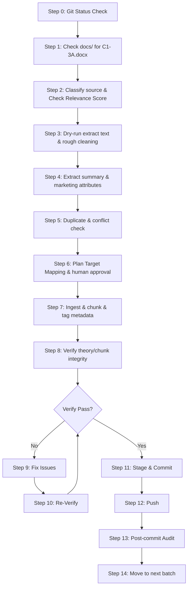

# Knowledge Ingestion SOP

## 1. Purpose (Mục đích)

- SOP này dùng để chuẩn hóa quy trình nạp tài liệu khóa học, kiến thức từ `docs/` vào bộ `agentic-ai-content-marketing-skill`.
- Mỗi lần người dùng chỉ định file hoặc yêu cầu nạp dữ liệu, Agent bắt buộc phải tuân theo đúng pipeline 15 bước nâng cao này (từ Step 0 đến Step 14).
- SOP này được áp dụng cho từng file hoặc từng nhóm file riêng lẻ theo từng batch riêng biệt, không dùng để tự động nạp hàng loạt mà không có sự kiểm soát.
- SOP này không thay thế cho sự phê duyệt trực tiếp của con người (Human Approval). Agent luôn phải xin xác nhận từ người dùng trước khi thực thi các bước quan trọng.

## 2. Trigger Phrase (Cụm từ kích hoạt)

Khi người dùng đưa ra các câu lệnh/yêu cầu có dạng:
- "Chạy gói nạp dữ liệu cho file X"
- "Nạp kiến thức từ file X"
- "Ingest file X vào SKILL"
- "Xử lý nạp dữ liệu cho source X"

Agent phải tự hiểu là cần kích hoạt và đi theo đúng pipeline của quy trình Knowledge Ingestion SOP nâng cao này.

## 3. Mandatory 15-Step Pipeline (Quy trình 15 bước bắt buộc)

Agent phải đi qua đầy đủ các bước sau đây theo thứ tự nghiêm ngặt:

### Step 0 — Current Git Safety Check
- Chạy lệnh: `git status --short` và `git status -sb`.
- Xác nhận rằng workspace hoàn toàn sạch (clean), ngoại trừ thư mục untracked `?? docs/`.
- Chỉ được tiếp tục nếu không có bất kỳ file staged hoặc modified chưa commit nào khác ngoài scope.

### Step 1 — Source Inventory And Exact Filename Confirmation
- Quét thư mục `docs/` để tìm file nguồn được yêu cầu.
- Xác nhận chính xác tên file nguồn (Exact Filename), định dạng file (docx, pdf, v.v.).
- Xác định rõ file nguồn thuộc chương nào, bài học nào (ví dụ: C1 - 3, C1 - 3A...). Không bao giờ đoán hoặc tự ý suy diễn tên file.

### Step 2 — Source Classification & Relevance Scoring
- Phân loại vai trò của nguồn tài liệu trong batch hiện tại (Primary, Supporting, Duplicate, Previously Ingested, New).
- Thực hiện **chấm điểm độ liên quan (Content Relevance Scoring)** của tài liệu với khung kiến thức Content Marketing (theo quy tắc tại Mục 12).
- Nếu Relevance Score dưới 40%, bắt buộc phải phát cảnh báo và kích hoạt điều kiện dừng khẩn cấp (Stop Condition), không tự động nạp tiếp.

### Step 3 — Dry-run Extraction And Rough Cleaning
- Đọc nội dung file nguồn bằng công cụ xem file hoặc trích xuất văn bản (nếu là docx/pdf, trích xuất text sạch).
- Thực hiện dọn dẹp thô (Rough Cleaning), kiểm tra chất lượng trích xuất (Extraction Quality), phát hiện lỗi ngắt dòng, lỗi font, mojibake.
- **Lưu ý**: Tuyệt đối chưa chỉnh sửa bất kỳ file nào trong bộ SKILL ở bước này.

### Step 4 — Knowledge Summary & Marketing Attributes
- Tóm tắt các kiến thức cốt lõi sẽ nạp.
- Trích xuất các thuộc tính marketing cốt lõi phục vụ việc phân loại và gọi lại kiến thức sau này (theo quy tắc tại Mục 15).

### Step 5 — Duplicate & Conflict Detection
- Quét đối chiếu chéo 3 nguồn để phát hiện trùng lặp hoặc xung đột kiến thức.
- Áp dụng chính sách giải quyết xung đột (**Conflict Resolution Policy** tại Mục 13) khi phát hiện mâu thuẫn giữa kiến thức mới và kiến thức đã nạp.

### Step 6 — Mapping Target File in SKILL
- Lập kế hoạch bản đồ nạp (Ingestion Plan). Đề xuất cụ thể danh sách file đích sẽ cập nhật hoặc tạo mới dựa trên Taxonomy phân loại kiến thức (Mục 10).
- Trình bày Ingestion Plan và xin xác nhận của người dùng trước khi tiến hành bước tiếp theo.

### Step 7 — Actual Ingestion / Chunking / Metadata Tagging
- Thực hiện cập nhật nội dung kiến thức vào các file đích đã đề xuất dưới dạng cộng dồn (incremental).
- Thực hiện phân khối ngữ nghĩa (**Semantic Chunking** tại Mục 14) đảm bảo bảo toàn ý nghĩa của câu, bảng biểu và hyperlink.
- Gắn thẻ metadata định dạng chuẩn Vector-Ready (Mục 16) đi kèm với từng chunk.
- Tuyệt đối loại bỏ các số/ký hiệu dẫn nguồn thô (raw source markers) khỏi phần văn bản chính, gom toàn bộ vào bảng Source Mapping Table ở chân tệp tin (Mục 19).

### Step 8 — Verification
- Kiểm tra và xác thực lại toàn bộ kiến thức sau khi nạp:
  - **Verify theory**: Đảm bảo lý thuyết chính xác, không mâu thuẫn.
  - **Verify scope**: Đảm bảo sửa đúng file trong scope, không lan man.
  - **Verify source-map / course-index / log**: Đảm bảo cập nhật đầy đủ thông tin nguồn, số lượng file, mã batch.
  - **Verify semantic chunk integrity**: Kiểm tra xem các chunk có bị cắt vỡ ý nghĩa, mất chủ ngữ/vị ngữ, hoặc hỏng bảng biểu/hyperlink không.
  - **Verify raw source markers**: Đảm bảo không còn ký hiệu/chữ số dẫn nguồn thô trong văn bản chính, tất cả đã được cấu trúc vào bảng mapping ở chân tệp tin (Mục 19).
  - **Verify encoding/mojibake**: Kiểm tra hiển thị tiếng Việt, không bị lỗi font.
  - **Verify docs safety**: Đảm bảo thư mục `docs/` vẫn an toàn, không bị sửa đổi.

### Step 9 — Fix If Verify Finds Issues
- Nếu bước Verification phát hiện ra bất kỳ lỗi hoặc điểm chưa nhất quán nào, thực hiện sửa lỗi ngay lập tức.
- Chỉ tập trung sửa đúng lỗi được chỉ ra, không tự ý mở rộng phạm vi điều chỉnh.

### Step 10 — Re-Verify After Fix
- Chạy lại toàn bộ quy trình Verification (Step 8) sau khi sửa đổi cho đến khi đạt trạng thái PASS hoàn toàn.

### Step 11 — Commit Exact Files Only
- Chỉ tiến hành tạo commit sau khi quá trình Verification đã **PASS** hoàn toàn.
- Sử dụng lệnh commit cụ thể cho các file đã thay đổi, chỉ stage các file được chỉ định cụ thể.
- **Tuyệt đối không dùng `git add .` hay `git add -A`**.
- Không bao giờ add thư mục `docs/` vào git staging.
- Đặt commit message rõ ràng, tuân thủ định dạng chuẩn của dự án và thể hiện rõ mã Batch.

### Step 12 — Push
- Đẩy các thay đổi đã commit lên remote an toàn.
- Đảm bảo quá trình truyền tải dữ liệu thành công không gặp lỗi kết nối hay xung đột nhánh.

### Step 13 — Post-Commit Audit
- Thực hiện kiểm tra lại trạng thái git sau khi push:
  - Kiểm tra xem commit có chứa file ngoài phạm vi không.
  - Đảm bảo branch `main` đang đồng bộ với remote.
  - Đảm bảo thư mục `docs/` vẫn là untracked.
  - Không tồn tại bất kỳ file tạm (temp files) nào trong repository.

### Step 14 — Move To Next Batch Only After Audit PASS
- Chỉ sau khi bước Post-Commit Audit này PASS, Agent mới đề xuất batch tiếp theo cho người dùng.

---

## 4. Security Gates (Cổng bảo mật bắt buộc)

Trong suốt quy trình nạp dữ liệu, Agent phải tuân thủ các cổng kiểm soát an toàn sau:

- **Relevance Gate**: Không nạp tài liệu nếu Relevance Score < 40%.
- **Conflict Isolation Gate**: Cô lập mọi mâu thuẫn không thể tự giải quyết bằng quy tắc timestamp vào vùng `#Pending_Review`, không ghi đè kiến thức cũ.
- **Semantic Chunk Gate**: Ngăn chặn tình trạng vỡ chunk hoặc ngắt câu làm hỏng ngữ pháp cốt lõi.
- **Scope Lock**: Chỉ chỉnh sửa các file thuộc phạm vi cho phép của Batch.
- **Source Lock**: Mọi kiến thức nạp vào phải có nguồn gốc rõ ràng từ file nguồn được chỉ định.
- **Docs Safety**: Tuyệt đối không thay đổi, đổi tên hay xóa các file trong thư mục `docs/`. Thư mục này luôn phải ở trạng thái untracked.
- **No Fabrication**: Không bịa đặt ví dụ hay lý thuyết không có trong tài liệu giảng dạy gốc.
- **No Duplicate Ingestion**: Kiểm tra kỹ lưỡng lịch sử nạp dữ liệu để tránh nạp lại file đã nạp.
- **No Wrong Folder**: Đặt đúng file vào đúng thư mục cấu trúc của bộ SKILL.
- **No Commit Before Verify**: Chỉ commit khi và chỉ khi verify đạt PASS.
- **Exact Git Add Only**: Chỉ stage chính xác các file chỉnh sửa, không dùng các lệnh add hàng loạt.
- **Encoding/Mojibake Safety**: Đảm bảo hiển thị tiếng Việt chuẩn UTF-8, không bị lỗi mã hóa ký tự.
- **Human Next-Step Approval**: Dừng lại xin ý kiến người dùng trước khi chuyển sang bước tiếp theo.

---

## 5. File Targeting Rules (Quy tắc định hướng file đích)

Khi ánh xạ kiến thức từ nguồn vào bộ SKILL, Agent phải phân phối chính xác theo cấu trúc thư mục sau:

1. **`00-course-knowledge/`**: Ghi nhận bản đồ nguồn (`source-map.md`) và mục lục tổng thể của khóa học (`course-index.md`).
2. **`01-core-principles/`**: Dành cho các tư duy nền tảng, tư duy viết marketing chung, triết lý cốt lõi của khóa học.
3. **`02-frameworks/`**: Dành cho các framework phân tích (như 5W-1H), các hệ thống bố cục cốt lõi (`content-layout-systems/01-core-layouts/`), và các framework hỗ trợ (`02-supporting-frameworks/`).
4. **`03-workflows/`**: Dành cho các quy trình hướng dẫn từng bước tạo lập content (ví dụ: Quy trình từ Raw Idea sang Outline).
5. **`04-commands/`**: Dành cho việc cấu hình hoặc định nghĩa các câu lệnh tương tác của Agent.
6. **`07-quality-gates/`**: Dành cho các checklist thẩm định chất lượng bài viết hoặc đánh giá mức độ phù hợp của bố cục (Layout-fit).
7. **`10-system/safety/`**: Dành riêng cho các tài liệu vận hành hệ thống, an toàn dữ liệu, và SOP nạp dữ liệu.

---

## 6. Batch Naming Convention (Quy ước đặt tên Batch)

Tên Batch của quy trình nạp dữ liệu phải tuân theo cấu trúc: `[Phase/Chapter]-[Batch Type]-[Batch Number]`
- Ví dụ: `3A-2I-1`, `3A-2I-2`, `3A-3I-1A`
- **Ký tự viết tắt của các bước**:
  - `I` = Ingestion (Nạp dữ liệu)
  - `V` = Verification (Xác thực)
  - `F` = Fix (Sửa lỗi)
  - `C` = Commit (Lưu thay đổi)
  - `PC` = Post-Commit Audit (Kiểm toán sau commit)
  - `P` = Plan (Lập kế hoạch)

---

## 7. Required Report Format (Mẫu báo cáo bắt buộc)

Sau mỗi batch hoặc bước lớn, Agent bắt buộc phải lập báo cáo theo định dạng sau:

```markdown
# Batch [Batch_ID] Ingestion Report

## 1. Verdict (Kết luận)
- [PASS / FAIL / PENDING]

## 2. Git Status
- Chi tiết trạng thái git hiện tại (`git status --short`).

## 3. Source Checked (Nguồn tài liệu đối chiếu)
- Danh sách các file nguồn trong `docs/` đã quét và sử dụng.

## 4. Files Touched (Các file đã chỉnh sửa/tạo mới)
- [MODIFY/NEW/DELETE] [tên_file](đường_dẫn_tuyệt_đối)

## 5. Security Gates (Kết quả kiểm tra cổng bảo mật)
- Kết quả đối chiếu với danh sách Security Gates.

## 6. Issues (Các vấn đề phát hiện)
- [Mô tả các vấn đề về trùng lặp, mâu thuẫn kiến thức hoặc lỗi kỹ thuật]

## 7. Next Recommended Action (Hành động khuyến nghị tiếp theo)
- Đề xuất bước tiếp theo chi tiết.
```

---

## 8. Stop Conditions (Điều kiện dừng khẩn cấp)

Agent bắt buộc phải dừng thực thi và báo cáo cho người dùng nếu gặp các điều kiện sau:
1. Workspace không sạch trước khi bắt đầu.
2. Tài liệu nguồn không tồn tại trong `docs/` hoặc không đúng tên yêu cầu.
3. Tên file nguồn không được chỉ định rõ ràng.
4. Phát hiện thay đổi ngoài phạm vi các file đích được cho phép.
5. File trong thư mục `docs/` vô tình bị đưa vào git staging.
6. Xuất hiện file tạm (temporary files) chưa được dọn dẹp.
7. Phát hiện rủi ro trùng lặp kiến thức cao mà chưa có phương án hợp nhất rõ ràng.
8. Phát hiện kiến thức mới mâu thuẫn trực tiếp với kiến thức cũ đã nạp.
9. Quá trình Verification chưa đạt trạng thái PASS hoàn toàn.
10. Commit scope bị sai lệch.
11. Git Remote Drift: Phát hiện branch cục bộ bị lệch so với origin/main trên server.
12. Relevance Score đánh giá dưới 40% (Mục 12).
13. Xảy ra xung đột kiến thức không thể giải quyết bằng timestamp (Mục 13).
14. Phát hiện chunk bị vỡ cấu trúc ngữ pháp nghiêm trọng (Mục 14).

---

## 9. Example Workflow For One File (Ví dụ quy trình thực tế cho một file)



---

## 10. Taxonomy Phân Loại Kiến Thức (Bổ sung từ tài liệu cũ)

| Loại kiến thức | Định nghĩa | Ví dụ | Nên nằm ở folder nào | Không nên nằm ở folder nào |
|---|---|---|---|---|
| Mindset | Tư duy nền điều khiển cách làm content. | AI hỗ trợ tư duy, không thay thế tư duy. | `00-course-knowledge/`, `01-core-principles/` | `05-templates/`, `06-reference-banks/` |
| Core principle | Nguyên tắc cốt lõi cần tuân thủ nhiều lần. | Outline trước khi viết. | `01-core-principles/` | `04-commands/`, `05-templates/` |
| Framework | Khung phân tích hoặc ra quyết định. | 5W-1H, audience angle. | `02-frameworks/` | `03-workflows/`, `06-reference-banks/` |
| Layout system | Nguyên lý sắp xếp ý trong nội dung. | Tổng phân hợp, quy nạp, móc xích. | `02-frameworks/content-layout-systems/01-core-layouts/` | `02-frameworks/5w1h-framework.md`, `05-templates/` |
| Workflow | Chuỗi bước thực thi một nhiệm vụ. | Raw idea to Facebook post. | `03-workflows/` | `02-frameworks/`, `06-reference-banks/` |
| Command | Giao diện tác vụ người dùng gọi trực tiếp. | `/post`, `/qa`, `/content-score`. | `04-commands/`, `10-system/control/COMMAND_MAPPING.md` | `01-core-principles/` |
| Template | Mẫu điền để triển khai output. | Facebook post template. | `05-templates/` | `02-frameworks/content-layout-systems/` |
| Checklist / Quality gate | Tiêu chí kiểm tra đạt/chưa đạt. | Content logic checklist. | `07-quality-gates/` | `03-workflows/` |
| Example | Ví dụ minh họa tốt/xấu hoặc output mẫu. | Good vs bad outline. | `08-examples/` | `01-core-principles/` |
| Reference bank | Kho câu, hook, CTA, transition dùng lại. | Hook bank, CTA bank. | `06-reference-banks/` | `02-frameworks/content-layout-systems/` |

---

## 11. Rule Xử Lý Tài Liệu Về Bố Cục (Bổ sung từ tài liệu cũ)

- **Phân tách rạch ròi**: 5W-1H là công cụ mở ý/brainstorm, Bố cục gốc là cách sắp xếp ý, Hook là điểm kéo sự chú ý, CTA là điểm điều hướng hành động, Template là mẫu triển khai theo nền tảng.
- **Cấm nhập chung**: Các khái niệm này liên quan mật thiết nhưng không được phép gộp chung vào một file kiến thức duy nhất.
- **Quy tắc tạo lập**:
  - Mỗi bố cục phải có file định nghĩa riêng trong `02-frameworks/content-layout-systems/01-core-layouts/` hoặc `02-supporting-frameworks/`.
  - Không đưa nội dung brainstorm 5W-1H vào file bố cục.
  - Không đưa hook bank hoặc CTA bank vào file bố cục.
  - Không biến bố cục thành template nền tảng nếu tài liệu đang nói về nguyên lý sắp xếp ý.
  - Nếu tài liệu nguồn chưa đủ rõ ràng, ghi trạng thái `Needs review` hoặc `Partially ingested`, tuyệt đối không tự sáng tác thêm chi tiết.

---

## 12. Content Relevance Scoring (Tính điểm độ liên quan)

Trước khi nạp dữ liệu, Agent phải đánh giá độ tương quan của tài liệu nguồn với lĩnh vực Content Marketing nhằm loại bỏ tài liệu nhiễu hoặc lạc đề.

1. **Phương pháp chấm điểm**:
   - Quét sự xuất hiện của các từ khóa định danh và khái niệm cốt lõi:
     - Nhóm A (Trọng số cao - 40%): `bố cục`, `layout`, `outline`, `dàn ý`, `cấu trúc bài viết`, `flow ý`.
     - Nhóm B (Trọng số trung bình - 30%): `content marketing`, `copywriting`, `người đọc`, `audience angle`, `hook`, `CTA`, `chuyển đổi`.
     - Nhóm C (Trọng số bổ trợ - 30%): `brand voice`, `tone`, `insight`, `pain point`, `Facebook post`, `blog post`.
2. **Quy tắc chặn (Gatekeeper Rule)**:
   - **Relevance Score >= 40%**: Đạt yêu cầu, cho phép tiến hành nạp.
   - **Relevance Score < 40%**: Không đạt yêu cầu. Agent phải ngay lập tức dừng lại, đưa ra cảnh báo cho người dùng về mức độ lạc đề của tài liệu thô và từ chối tự động nạp.

---

## 13. Conflict Resolution Policy (Chính sách giải quyết xung đột)

Khi kiến thức mới từ tài liệu nguồn mâu thuẫn trực tiếp với kiến thức đã nạp sẵn trong SKILL (ví dụ: định nghĩa khác nhau về cùng một bố cục, quy tắc viết trái ngược nhau):

1. **Quy tắc ưu tiên Timestamp (Timestamp Priority)**:
   - Nếu tài liệu nguồn mới có thuộc tính ngày sửa đổi/ngày phát hành (Timestamp) rõ ràng và mới hơn kiến thức hiện tại: Ưu tiên cập nhật theo kiến thức mới, đồng thời lưu trữ kiến thức cũ vào mục "Historical Context" hoặc "Deprecated Version".
2. **Quy tắc cô lập (Isolation of Ambiguity)**:
   - Nếu hai nguồn kiến thức có cùng timestamp, hoặc không xác định được timestamp, hoặc mâu thuẫn quá nghiêm trọng: Agent **tuyệt đối không được ghi đè** lên kiến thức cũ.
   - Phải cô lập phần kiến thức mâu thuẫn đó vào một khối ghi chú có tag `#Pending_Review` trong file đích để người dùng quyết định thủ công.
3. **Quy định ghi nhận**: Mọi xung đột kiến thức phát hiện và cách xử lý phải được ghi nhận rõ ràng vào báo cáo Batch Report.

---

## 14. Semantic Chunking Verification (Xác thực phân khối ngữ nghĩa)

Để đảm bảo các khối kiến thức (chunks) lưu trữ trong SKILL giữ nguyên ý nghĩa và có cấu trúc mạch lạc khi AI Agent đọc và tìm kiếm:

1. **Bảo toàn cấu trúc ngữ pháp**:
   - Không được cắt đôi câu giữa chừng. Một chunk kiến thức tối thiểu phải chứa đầy đủ ý nghĩa (chủ ngữ - vị ngữ) và mạch ý hoàn chỉnh.
2. **Xử lý bảng biểu (Table Ingestion)**:
   - Bảng biểu trong tài liệu DOCX/PDF thô bắt buộc phải được chuyển đổi thành định dạng Markdown Table chuẩn hoặc cấu trúc JSON trực quan. Không được trích xuất bảng biểu thành các dòng văn bản rời rạc mất tiêu đề cột/hàng.
3. **Xử lý Hyperlink**:
   - Giữ nguyên các liên kết (hyperlinks) đi kèm trong tài liệu.
   - Kiểm tra trạng thái liên kết và định dạng liên kết đúng cú pháp Markdown: `[Tên liên kết](URL)`.
4. **Heading Path Metadata**:
   - Mỗi chunk khi nạp vào file đích phải ghi nhận đường dẫn tiêu đề hoàn chỉnh (Heading Path) từ gốc đến ngọn (ví dụ: `Bố cục Liệt Kê -> Định nghĩa -> Nguyên tắc`) để đảm bảo không bị mất ngữ cảnh của khối thông tin khi tách rời.

---

## 15. Knowledge Enrichment & Tagging (Làm giàu & Gắn thẻ marketing)

Mỗi khối kiến thức (chunk) hoặc tài liệu sau khi nạp phải được làm giàu bằng cách gắn các thẻ marketing đặc thù. Điều này hỗ trợ các Agent viết content dễ dàng truy vấn và triệu hồi đúng mảnh ghép kiến thức cần thiết:

- `#Target_Audience`: Định nghĩa nhóm độc giả mục tiêu mà kiến thức này hướng đến (ví dụ: `#audience_B2B`, `#audience_genz`).
- `#Pain_Point`: Nhóm vấn đề/nỗi đau của người đọc mà kiến thức này giải quyết (ví dụ: `#painpoint_bi_y_tuong`, `#painpoint_doc_luot`).
- `#Angle`: Góc nhìn tiếp cận nội dung bài viết (ví dụ: `#angle_chuyen_gia`, `#angle_trai_nghiem`).
- `#Brand_Voice` (nếu có): Tông giọng thương hiệu phù hợp (ví dụ: `#voice_chuyen_nghiep`, `#voice_hai_huoc`).
- `#Use_Case` (nếu có): Trường hợp áp dụng thực tế (ví dụ: `#usecase_viet_post_FB`, `#usecase_viet_landing_page`).
- `#Content_Format` (nếu có): Định dạng bài viết đề xuất (ví dụ: `#format_carousel`, `#format_long_form`).

---

## 16. Vector-Ready Metadata Format (Định dạng Metadata sẵn sàng cho Vector Search)

Mặc dù hệ thống không cấu hình cơ sở dữ liệu Vector (Vector Database) vật lý hay viết code API nhúng (embeddings), nhưng mọi khối kiến thức nạp vào SKILL phải tuân thủ cấu trúc khai báo metadata dưới định dạng JSON ở đầu file hoặc đi kèm chunk để sẵn sàng cho việc indexing sau này:

```json
{
  "chunk_id": "Mã định danh duy nhất (ví dụ: 3A-SOP-02-A-001)",
  "source": "Tên file nguồn chính xác trong docs/",
  "heading_path": "Đường dẫn thư mục và tiêu đề đầy đủ",
  "timestamp": "Thời gian nạp hoặc ngày sửa đổi tài liệu",
  "relevance_score": 0.00,
  "marketing_tags": {
    "target_audience": [],
    "pain_point": [],
    "angle": [],
    "brand_voice": [],
    "use_case": [],
    "content_format": []
  }
}
```

---

## 17. Incident Recovery (Xử lý khi AI Agent nạp sai)

Khi phát hiện hoặc có nghi ngờ AI Agent nạp sai kiến thức (sai lệch lý thuyết, sai vị trí, trộn lẫn layout, hoặc ghi đè kiến thức cũ mà chưa được phép), hệ thống và Operator phải thực hiện ngay quy trình khôi phục sự cố sau:

1. **Dừng khẩn cấp (Emergency Stop)**:
   - Ngừng ngay lập tức toàn bộ quá trình nạp hoặc chạy batch hiện tại.
   - Không thực hiện bất kỳ lệnh commit hay push nào thêm.
2. **Truy vết lỗi (Incident Inquest & Trace)**:
   - Chạy lệnh `git diff` đối với các file đã chỉnh sửa trong batch hiện tại để xác định chính xác các dòng/nội dung bị nạp sai lệch.
   - Kiểm tra log của Agent để xác định nguyên nhân.
3. **Lập Incident Report**:
   - Ghi nhận sự cố vào `INGESTION_LOG.md` hoặc báo cáo trực tiếp cho người dùng dưới dạng Incident Report gồm: nội dung bị sai, nguyên nhân, các file bị ảnh hưởng.
4. **Xây dựng Revert & Fix Plan**:
   - Xác định phương án khắc phục:
     - Nếu chưa commit: Sử dụng các lệnh phục hồi cục bộ an toàn để đưa file về trạng thái sạch.
     - Nếu đã lỡ commit nhưng chưa push: Lên kế hoạch tạo commit sửa đổi (fix commit) hoặc liên hệ con người để revert commit an toàn.
5. **Thực thi sửa đổi & Tái xác thực (Re-verification)**:
   - Thực hiện sửa lại nội dung cho đúng tài liệu gốc hoặc revert về trạng thái sạch của batch trước.
   - Chạy lại toàn bộ quy trình Verification (Step 8) để đảm bảo không còn lỗi font, mojibake, mâu thuẫn hay sai lệch file.
6. **Human Sign-off**:
   - Trình báo cáo sửa đổi cho người dùng và chỉ tiếp tục batch khi được người dùng phê duyệt rõ ràng.

---

## 18. Ingestion History Recovery (Đối chiếu lịch sử nạp)

Để đảm bảo không bị ghi đè dữ liệu lịch sử hoặc nạp thiếu, Agent phải thường xuyên đối chiếu chéo lịch sử nạp dữ liệu:

1. **Đối chiếu chéo ba điểm (Triple Cross-Reference Check)**:
   - Trước mỗi batch, Agent bắt buộc phải đối chiếu chéo thông tin từ 3 nguồn:
     - `00-course-knowledge/source-map.md` (kiểm tra trạng thái file nguồn đã nạp/chưa nạp).
     - `00-course-knowledge/course-index.md` (kiểm tra sự tồn tại của bài học trong cấu trúc tổng thể).
     - `INGESTION_LOG.md` (kiểm tra nhật ký hành trình thực tế của các batch trước).
2. **Xác thực đồng bộ dữ liệu (Sync Validation)**:
   - Đối chiếu số lượng bài học, chương, và file nguồn đã ghi nhận là "Đã nạp" trong source-map với lịch sử commit thực tế của git.
   - Nếu phát hiện sự lệch pha, Agent phải lập tức dừng lại, đưa vào mục `Issues / Ambiguities` của báo cáo và yêu cầu người dùng hướng dẫn xử lý.

---

## 19. Quy Tắc Dẫn Nguồn & Tránh Raw Source Markers (Source Traceability & Cleanliness Rules)

Để đảm bảo các tệp tin lý thuyết/bố cục (layout/framework files) trong SKILL luôn sạch đẹp, có tính chuyên nghiệp và sẵn sàng cho việc huấn luyện/sử dụng AI, Agent phải tuyệt đối tuân thủ quy tắc quản lý dẫn nguồn sau:

1. **Tuyệt đối KHÔNG giữ các ký hiệu/số dẫn nguồn thô** dạng chữ số trần (như `1`, `3`, `5-7`, `[1]`, `[3]`) trực tiếp trong phần văn bản chính (main body) của tệp tin layout/framework.
2. **Quản lý Traceability tập trung**:
   - Nếu cần đối chiếu hoặc truy xuất nguồn gốc dòng văn bản/đoạn trích xuất học liệu, Agent phải gom toàn bộ thông tin này xuống bảng **Source Mapping Table** ở cuối tệp tin đích hoặc lưu trong `source-map.md`, `INGESTION_LOG.md`, hoặc metadata block.
   - Bảng **Source Mapping Table** ở cuối mỗi tệp tin layout/framework phải được thiết kế rõ ràng với các trường: `Section` (Phân đoạn), `Key Knowledge / Statement` (Kiến thức cốt lõi), `Source File` (Tên file nguồn), `Source Marker / Paragraph` (Ký hiệu nguồn/Số đoạn §), và `Confidence` (Độ tin cậy).

