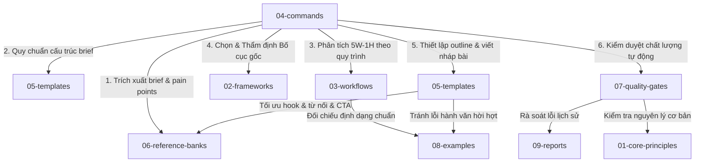

# Agentic AI Content Marketing Skill

## Bắt đầu tại đây / Trung tâm điều hướng

### Dành cho AI Agent
Đọc:
1. SKILL.md
2. 10-system/control/COMMAND_MAPPING.md
3. 10-system/control/PROMPT_MASTER.md
4. Relevant command file in 04-commands/
5. Relevant quality gate in 07-quality-gates/

### Dành cho Operator / Team Member
Đọc:
1. 10-system/guides/OPERATOR_PLAYBOOK.md
2. 10-system/guides/USAGE_GUIDE.md
3. 10-system/control/COMMAND_MAPPING.md
4. 07-quality-gates/final-output-checklist.md

### Dành cho người bảo trì skill (Maintainer)
Đọc:
1. 10-system/handoff/FINAL_PACKAGING_SNAPSHOT.md
2. 10-system/handoff/HANDOFF_SUMMARY.md
3. INGESTION_LOG.md
4. 10-system/control/PACKAGING_CHECKLIST.md

### Nếu bạn muốn nạp kiến thức mới (ingestion)
Dừng lại. Đọc trước:
1. [DATA_INGESTION_SAFETY.md](10-system/safety/DATA_INGESTION_SAFETY.md)
2. [INGESTION_SOP.md](10-system/safety/INGESTION_SOP.md)
3. [source-map.md](00-course-knowledge/source-map.md)
4. [course-index.md](00-course-knowledge/course-index.md)
5. [INGESTION_LOG.md](INGESTION_LOG.md)

Lệnh gọi Agent nạp dữ liệu:
```txt
@Data_Ingestion_Agent
File: docs/[exact_filename].docx
Mode: plan
```
Chi tiết xem tại [Data_Ingestion_Agent.md](04-commands/Data_Ingestion_Agent.md).
Yêu cầu người dùng xác nhận exact source files trước khi tiến hành nạp.

## Phân định vai trò các file
- README.md = trung tâm điều hướng cho người dùng và maintainer.
- SKILL.md = file khởi chạy (runtime entry) cho AI Agent.
- INGESTION_LOG.md = nhật ký nạp kiến thức/lịch sử.
- 10-system/control/ = bản đồ lệnh, prompt gốc, checklist đóng gói.
- 10-system/safety/ = quy tắc an toàn nạp dữ liệu và SOP.
- 10-system/guides/ = hướng dẫn sử dụng hàng ngày và playbook cho operator.
- 10-system/handoff/ = bản ghi trạng thái cuối và tóm tắt bàn giao.
- 09-reports/ = lịch sử report, không cần đọc hàng ngày.

## Không đọc toàn bộ hệ thống mặc định
Không đọc toàn bộ hệ thống nếu task nhỏ.

- Viết Facebook post → đọc /post + layout selection + final output checklist.
- Lập outline → đọc /outline + layout taxonomy/matrix.
- QA content → đọc /qa + quality gates.
- Chấm điểm content → đọc /content-score + quality gates.
- Ingest knowledge → dừng lại và đọc safety files trước.

## Lệnh và Agent Vận hành

Bộ SKILL cung cấp các câu lệnh tương tác và các Agent chuyên biệt để thực hiện các tác vụ content marketing hoặc nạp dữ liệu:

### 1. Data Ingestion Agent (`@Data_Ingestion_Agent`)
- **Vai trò**: Nạp an toàn và thông minh các tài nguyên, tài liệu, học liệu khóa học mới (PDF, DOCX...) từ thư mục `docs/` vào bộ SKILL theo quy trình chuẩn SOP-02.
- **Cách gọi lệnh (Invocation Format)**:
  ```txt
  @Data_Ingestion_Agent
  File: docs/[exact_filename].docx
  Mode: plan
  ```
- **Các chế độ (`Mode`)**:
  - `plan` (hoặc `dry-run`): Chạy kiểm tra, đánh giá độ liên quan, phát hiện trùng lặp/xung đột và lên kế hoạch ánh xạ tệp tin đích. Không sửa đổi mã nguồn.
  - `execute` (hoặc `ingest`): Thực thi nạp dữ liệu thật sự sau khi bản kế hoạch lập ở chế độ `plan` được phê duyệt.
- **Tài liệu hướng dẫn chi tiết**: [Data_Ingestion_Agent.md](04-commands/Data_Ingestion_Agent.md)

### 2. Content Marketing Agent (`@Content_Marketing_Agent`)
- **Vai trò**: Tự động chuyển đổi nội dung thô, brief ý tưởng thành bài viết marketing hoàn chỉnh theo đúng các tiêu chuẩn và bố cục gốc của hệ thống.
- **Cách gọi lệnh (Invocation Format)**:
  ```txt
  @Content_Marketing_Agent
  Platform: [Facebook / Blog / LinkedIn / TikTok / v.v.]
  Input: [Nội dung thô / Tài liệu / Brief ý tưởng]
  Goal: [Mục tiêu bài viết, ví dụ: viết bài marketing giới thiệu BBO Tech]
  Tone: [Tông giọng mong muốn, ví dụ: rõ ràng, tự nhiên, chuyên gia, không sáo rỗng]
  ```
- **Tài liệu hướng dẫn chi tiết**: [Content_Marketing_Agent.md](04-commands/Content_Marketing_Agent.md) (được bảo vệ bởi cơ chế *Knowledge Coverage Guard* kiểm soát phạm vi kiến thức bố cục và *Input Grounding Guard* phòng chống rò rỉ hoặc tự chế số liệu không căn cứ).

### 3. Các câu lệnh Content khác (Xem chi tiết tại 04-commands/)
- `/outline`: Lập dàn ý bài viết marketing.
- `/post`: Viết bài post hoàn chỉnh dựa trên dàn ý.
- `/qa`: Kiểm định chất lượng bài viết theo quality gates.
- `/content-score`: Chấm điểm chất lượng nội dung.

## Bộ Skill này hỗ trợ gì
- Phân tích brief content marketing.
- Xác định audience, pain point, insight.
- Brainstorm bằng 5W-1H.
- Chọn layout phù hợp.
- Viết outline 5 phần.
- Viết Facebook post.
- QA và chấm điểm content.
- Bảo vệ quy trình ingestion an toàn.

## Quy tắc an toàn cốt lõi
- Không ingest docs mới nếu user chưa xác nhận exact source files.
- Không dùng 5W-1H như layout chính.
- Không dùng Professional planning như root layout.
- Không nâng confidence/status layout nếu chưa có source riêng.
- Không sửa file ngoài phạm vi batch.
- Không tạo thêm file nền nếu không thật sự cần.

## Cấu trúc thư mục hiện tại
```text
agentic-ai-content-marketing-skill/
├── 00-course-knowledge/   # Bản đồ nguồn & registry kiểm soát học liệu
├── 01-core-principles/     # Các nguyên lý nội dung nền tảng
├── 02-frameworks/          # Khung tư duy và Hệ thống bố cục gốc (C1-3A/C1-3B)
├── 03-workflows/           # Hướng dẫn quy trình thực hiện từng bước chi tiết
├── 04-commands/            # File câu lệnh và định nghĩa của các Agent vận hành
├── 05-templates/           # Các mẫu cấu trúc outline, bài post, script
├── 06-reference-banks/     # Thư viện câu, hooks, CTA, pain points viết sẵn
├── 07-quality-gates/       # Checklists kiểm duyệt chất lượng từng giai đoạn
├── 08-examples/            # Các ví dụ đối chiếu Good vs. Bad thực tế
├── 09-reports/             # Báo cáo lịch sử kiểm tra và thử nghiệm các Batch
├── 10-system/              # SOPs nạp dữ liệu, guides vận hành và an toàn
├── INGESTION_LOG.md        # Nhật ký các đợt cập nhật và nạp kiến thức
├── README.md               # Trung tâm điều hướng hệ thống
└── SKILL.md                # Điểm khởi chạy runtime của AI Agent
```

## Bản Đồ Sử Dụng Kiến Trúc (Architecture Usage Map)

Trong quá trình vận hành, các thư mục kiến thức tương tác chặt chẽ với nhau thông qua quy trình tự động của `@Content_Marketing_Agent`:



- **Quy trình kết nối**:
  1. **Nhập brief & Phân tích**: `04-commands/` gọi `05-templates/content-brief-template.md` và `06-reference-banks/pain-point-bank.md`.
  2. **Brainstorming**: Sử dụng quy trình `03-workflows/5w1h-brainstorming-workflow.md`, template `05-templates/5w1h-analysis-template.md`, đối chiếu `08-examples/example-5w1h-analysis.md`.
  3. **Xác thực Bố cục**: Dựa vào matrix/taxonomy tại `02-frameworks/content-layout-systems/00-layout-system-control/layout-selection-matrix.md`, đối chiếu `08-examples/example-content-layout.md`.
  4. **Lập Outline**: Theo form của `05-templates/content-outline-template.md` phối hợp thư viện `06-reference-banks/hook-bank.md` và đối chiếu mẫu `08-examples/good-vs-bad-outline.md`.
  5. **Drafting (Chấp bút)**: Tuân thủ quy trình chuyển thể tại `03-workflows/outline-to-content-workflow.md`, áp dụng template `05-templates/facebook-post-template.md`, bổ sung từ nối/dẫn nhập/CTA từ `06-reference-banks/`, đối chiếu ví dụ tốt/xấu tại `08-examples/good-vs-bad-facebook-post.md` và bài viết mẫu tại `08-examples/example-final-output.md`.
  6. **QA & Scoring**: Chạy quy trình `03-workflows/content-qa-workflow.md` & `03-workflows/content-rewrite-workflow.md`, tra cứu checklist tại `07-quality-gates/` và kiểm tra lỗi lịch sử đã ghi nhận trong `09-reports/` (ví dụ: `09-reports/BATCH_002I_FIRST_CONTROLLED_WORKFLOW_TEST_REPORT.md` và `09-reports/BATCH_002K_RETEST_FIXED_WORKFLOW_ISSUES_REPORT.md`).

## Bước sử dụng tiếp theo
Sử dụng skill này cho công việc content thực tế.
Không tạo thêm file nền tảng.
Chỉ lên kế hoạch Batch 3A sau khi user xác nhận exact source files.
